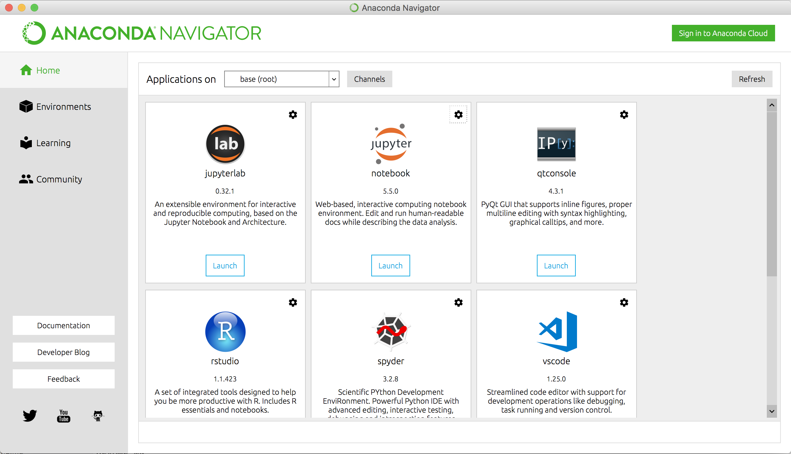
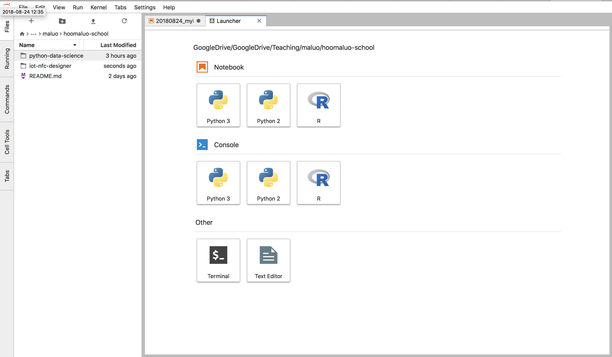
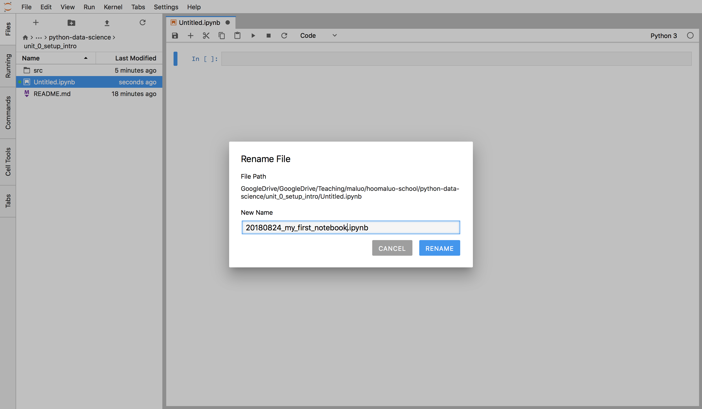
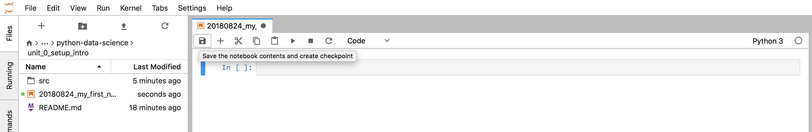
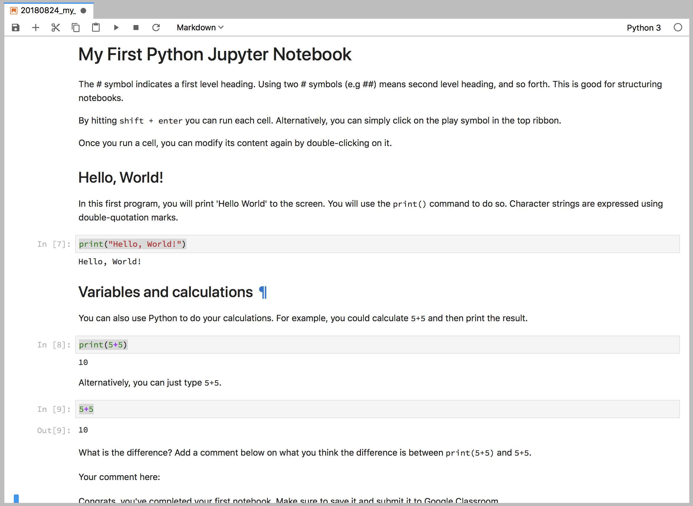
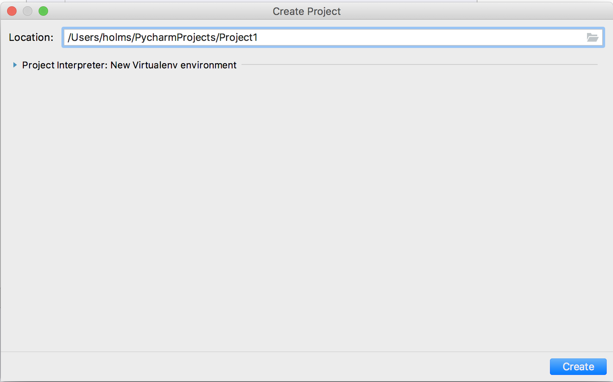
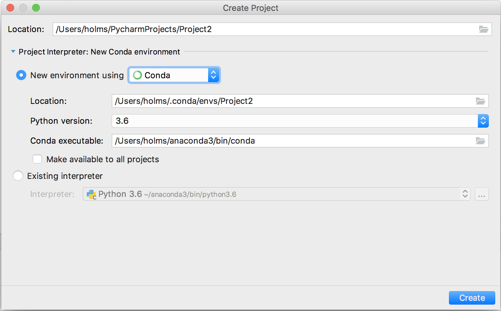
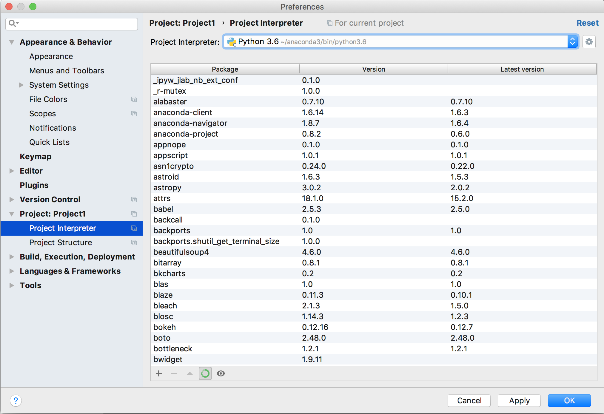

# Setup and Installation

Before we can get started and dive into your first Python programming lesson, we need to install Python on your local machine. While you most likely already have some version of Python installed, we want to make sure that everyone is using the same environment for development. That is, you will use two tools to use Python: <br>
* [Jupyter notebook]() in the [Anaconda framework]() for lessons and projects
* [PyCharm Edu]() for tutorials

Use the instructions below to install each environment. Make sure to follow the recommended steps for your operating system.

## Anaconda

### Installation
You need to install Anaconda Version 5.2 for **Python 3.6** for your operating system. All downloads can be found on the [official downloads page](https://www.anaconda.com/download/). (The page will default to your operating system, so that you can scroll down and click the Python 3.6 version.) <br>
Alternatively, here is a list to the direct download:
* [Windows 64-bit installer](https://repo.anaconda.com/archive/Anaconda3-5.2.0-Windows-x86_64.exe)
* [macOS installer](https://repo.anaconda.com/archive/Anaconda3-5.2.0-MacOSX-x86_64.pkg)
* [Linux installer](https://repo.anaconda.com/archive/Anaconda3-5.2.0-Linux-x86_64.sh)

More instructions on the installation process can be found here:
* [Windows Installation Docummentation](https://docs.anaconda.com/anaconda/install/windows)
* [macOS Installation Instructions](https://docs.anaconda.com/anaconda/install/mac-os.html)
* [Linux Installation Instructions](https://docs.anaconda.com/anaconda/install/linux.html)

### Using the Jupyter notebook

The Jupyter notebook is a really amazing tool that let's you to to write codes and reports at the same time by simply interspersing code with markdown (md) comments. This is great, because you can for example copy/paste the task or problem statement, then document your thought process, then test some code, and then document your results. Let's see how we can use this.

* Launch the Anaconda Navigator
  
* Launch Jupyterlab
* Create a `python-data-science` folder using the sidebar.
  * For example, go to your `Documents` folder
  * Click on the new folder icon
  * Name the folder `python-data-science`
* Now create a `Python 3 Notebook`
  
* Rename the notebook based on today's date and the title that you want to give the notebook, e.g. `20180821_my_first_notebook.`
  
* Save the empty notebook
  

Congrats, now you're ready to start you first notebook.

### First Jupyter notebook

Let's take a look at what we can do here. If you click on a line in your notebook, you can click on the drop-down menu and change the type to `Code`, `Markdown`, or `Raw`. You want to use the `Markdown` type for all comments and the `Code` type when you try to write code. Let's try it.

Change the first block to a Markdown block, and then enter the following:
```md
# My First Python Jupyter Notebook

The # symbol indicates a first level heading. Using two # symbols (e.g ##) means second level heading, and so forth. This is good for structuring notebooks.

By hitting `shift + enter` you can run each cell. Alternatively, you can simply click on the play symbol in the top ribbon.

Once you run a cell, you can modify its content again by double-clicking on it.
```
Run it and see how the formatting changes.

Next you will create a `Hello World` progam. You will create an introductory comment (Markdown) cell and enter
```md
## Hello, World!

In this first program, you will print 'Hello World' to the screen. You will use the `print()` command to do so. Character strings are expressed using double-quotation marks.
```
Then you'll write the actual program (Code).
```py
print("Hello, World!")
```

Add the following cells as well:


```md
## Variables and calculations

You can also use Python to do your calculations. For example, you could calculate `5+5` and then print the result.
```

```py
print(5+5)
```

```md
Alternatively, you can just type `5+5`.
```

```py
5+5
```

```md
What is the difference? Add a comment below on what you think the difference is between `print(5+5)`` and `5+5`.
```

```md
Your comment here:
```

```md
Congrats, you've completed your first notebook. Make sure to save it and submit it to Google Classroom.
```

Wihtout running the cells, your file should look as follows:


After running each cell, it should look like this:


## PyCharm Edu

PyCharm Edu is not only an education tool and learning system, PyChrarm itselft is also a professional development platform for Python. We will provide courses that you can independently complete to learn the class concepts.

### Installation
You will need to download the appropriate PyCharm Edu for your operating system from [this platform](https://www.jetbrains.com/pycharm-edu/download/).

You can jump directly to the download versions using the following links:
* [Windows 64-bit installer](https://www.jetbrains.com/pycharm-edu/download/download-thanks.html?platform=windows)
* [macOS installer](https://www.jetbrains.com/pycharm-edu/download/download-thanks.html?platform=mac)
* [Linux installer](https://www.jetbrains.com/pycharm-edu/download/download-thanks.html?platform=linux)

On the downloads page, you will also find the following instructions:
* Windows:
  * Run the pycharm-edu-2018.2.exe file that starts the Installation Wizard
  * Follow all steps suggested by the wizard. Please pay special attention to the corresponding installation options
* macOS:
  * Download the pycharm-edu-2018.2.dmg disk Image file
  * Mount it as another disk in your system
  * Copy PyCharm Edu to your Applications folder
* Linux:
  * Unpack the pycharm-edu-2018.2.tar.gz to to an empty directory file using the following command:
tar -xzf pycharm-edu-2018.2.tar.gz
  * Run pycharm-edu.sh from the bin sub-directory

### Configuration

You will need to configure your PyCharm environment to use the Anaconda Python3.6 Interpreter. This is important when you create new projects. You can follow the these steps:
1. Open PyCharm
2. Create a new project
  
3. Click on the little arrow in fron of `Project Interpreter` and choose the `new environment using` `Conda` option. The `Python version` should be `3.6`.
  
If you've already created a project and missed to change the interpreter, no problem. You can follow these steps:
1. Click on >Preferences >Project >Project Interpreter and select the Python 3.6 interpreter.
  
2. If you don't see the Python 3.6 Interpreter, you may need to add it by clicking on the three dots in the image below.

### Loading a course

Throughout this class, you will work through courses that we're providing. There will most likely be one course for every week. The process is very straight forward, you:
1. Donwload the course as a `.zip` file from our github or Google Classroom
2. In PyCharm, you click `Browse Courses`
3. You click the little icon on the lower left in the image below and click `Import local course`.
  
4. You select the `.zip` file that you previously downloaded.
5. You click `Join`.

To practice this, please import and complete the `Hoomaluo - Test Course`.

### Creating a new project

Instead of using the Jupyter notebook environment, you could do all your code development in PyCharm by creating new projects, creating Python files in the project, and then running those files in the the PyCharm environment. This is a common approach when developing bigger software application.

In the beginning, we want you to rather use the Jupyter notebook environment, but feel free to explore this option on your own.

## Summary

Wow ... that was quite a lot. To recap, we've installed the Anaconda framework and the PyCharm IDE and its education tools. You will use the Jupyter notebook to complete all your work assignments and use the PyCharm Edu environment to complete self-graded interactive tutorials.
