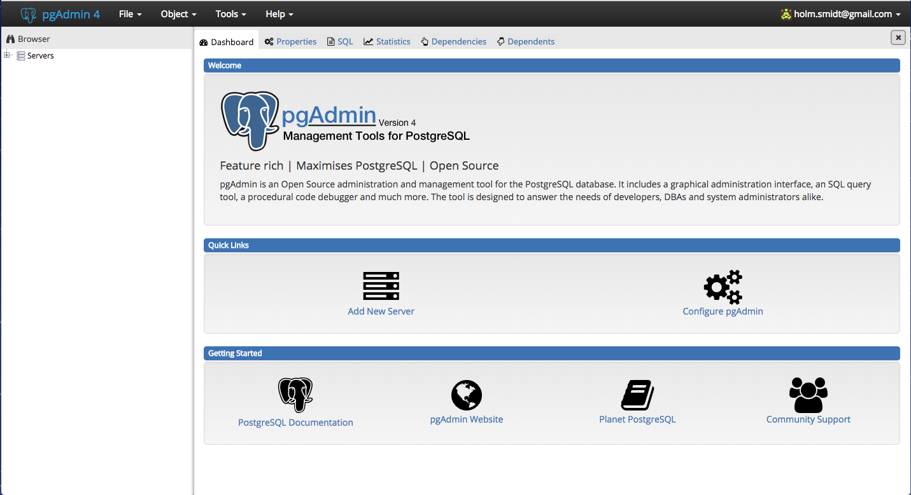
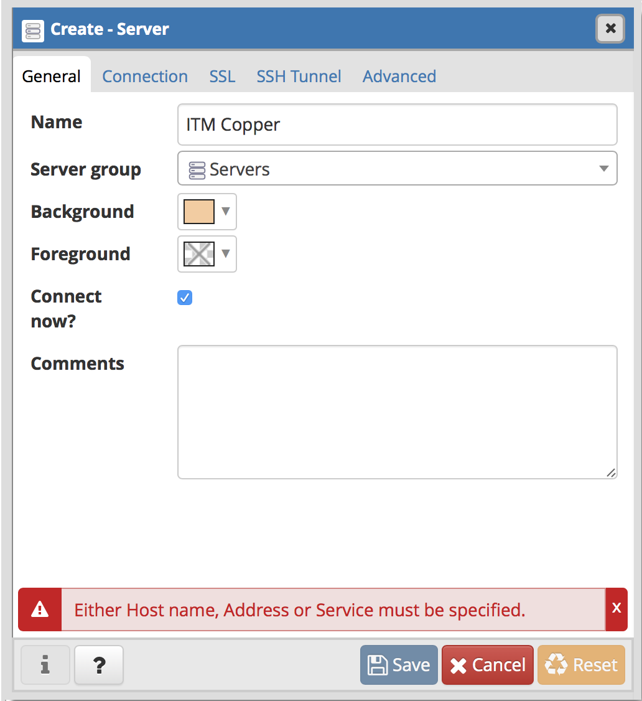
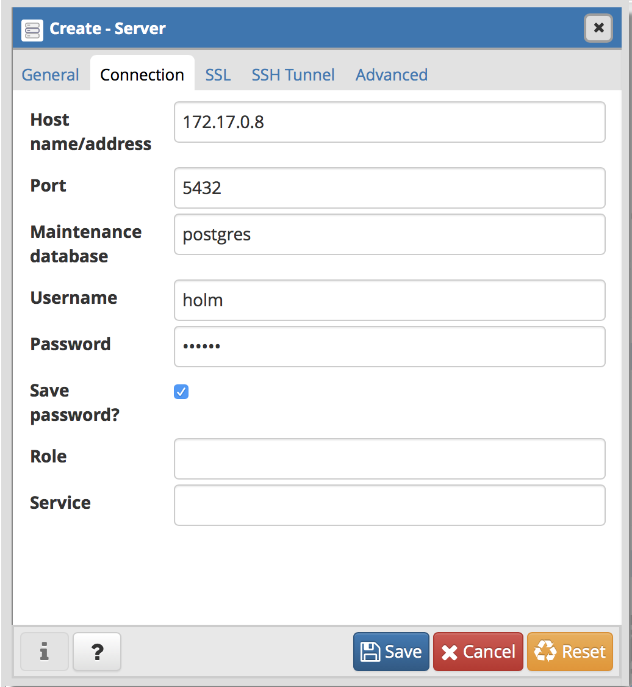
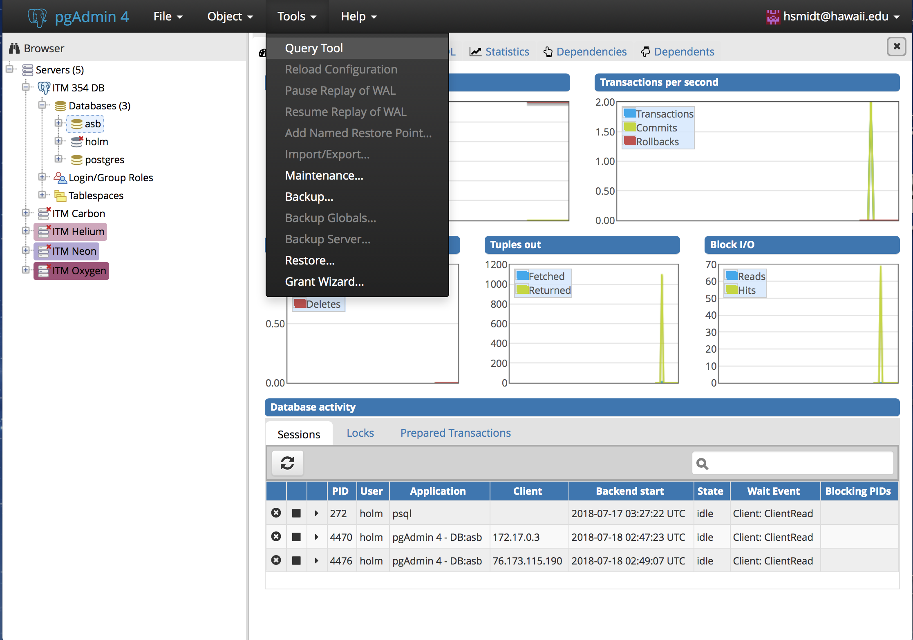
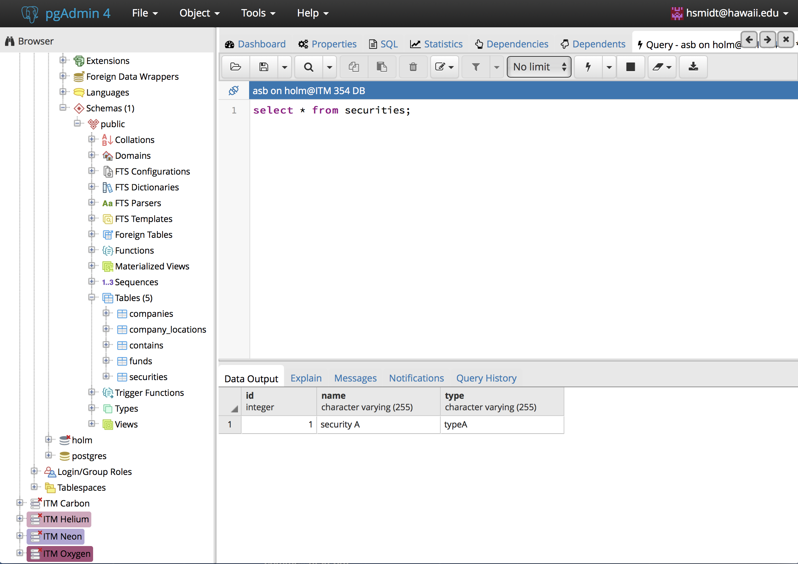

# Introduction to Databases

**Databases** are structured collections of related data. Data are simply facts that can be recorded and accessed. **Data formats** include text, numbers, figures, graphics, images, audio/video recordings and more. In sensor applications, we typically want to store out data in a structured fashion so that we can easily access them. While there are different types of databases, the most fundamental type of database is a relational database. Relational databases are collections of related relations within which each relation has a unique name.

In the next few steps, you will learn how to connect to a database server using a database administration interface (pgadmin), create tables, insert data into tables, and query data from tables.

## Connecting to a DB server

First you will need to log in to the adminstration application (pgadmin). Go to http://deep.outtter.space:55082/browser/, and login with your credentials (ask instructor for your credentials). You should see this screen.



The first thing to do now is to `Add New Server` using the link in the Quick Link section. The server configurations are specific to each student.

* Under the **General** tab, you want to give the server a name, e.g. Daniel's DB, and maybe pick your preferred background and foreground colors.

  
* Under the **Connection** tab, you want to enter the provided IP for your DB as the Host name. This should be **deep.outtter.space**. The port and maintenance database are **55085** and **postgres** respectively. Lastly, enter you **username** (should be your first name all lower case) and **password** (your first name + 01). To make it easier on yourself, just check the `Save password?` checkbox.

  
* Click save and hopefully it will connect you to your DB.
* To debug, or if this fails at any point, make sure that the IP, username, and password are entered correctly. If it still doesn't work, contact the instructor as the IP may have changed due to a container restart.

## Creating a table

We use Structured Query Language (SQL) to interface with database systems. First, you need to access the query tool (see below):



Using the query tool (see below), the following code block explains how to create tables:



```pseudo
CREATE TABLE tablename (
  Att1 	DataType ,
	Att2	DataType ,
		…
);
```

For example:
```sql
CREATE TABLE vendor (
  vendorid  CHAR(2) NOT NULL,
  vendorname  VARCHAR(25) NOT NULL,
  PRIMARY KEY (vendorid));
```

Maybe a more relevant example would be
```sql
create table measurements (
	id int generated by default as identity,
	ts timestamp,
	temperature float,
	humidity float,
	heatindex float,
  primary key (id)
)
```

The primary key must be unqiue for every entry, so it's good to generate them by default as an increasing integer.


## Inserting Data

Data inserts are very important, since that's how you can insert your sensor data into your database.

You can run this example in your query tool to test it out:

```sql
insert into measurements (ts, temperature, humidity, heatindex) values (now(), 76.2, 80.1, 70.1)
```

## Selecting Data

Selecting or reading data from the database is the most commonly used command, the following gives an example on how to select all data from a table:

```sql
select * from measurements;
```

You can also specify which columns and in which order you want to select them:

```sql
select ts, temperature, humidity from measurements;
```

Note that here, I did not want the `id` and the `heatindex`.

Congratulations, you set up your first database. Now we'll see how you can insert data from node-red.

## Node-Red
